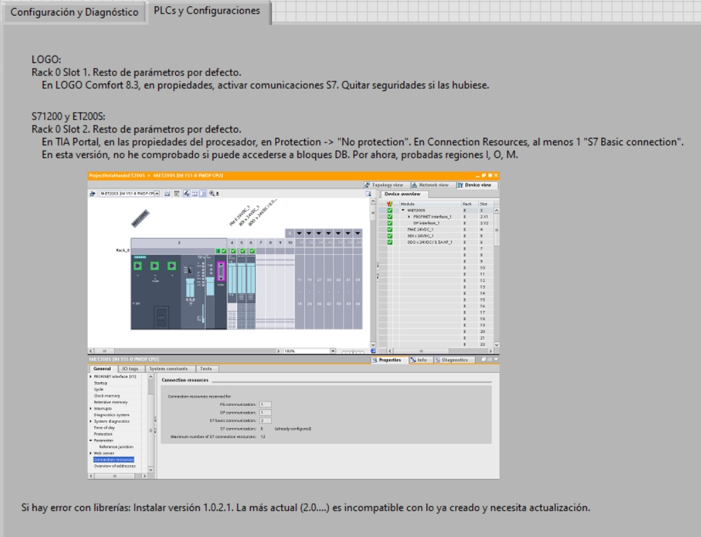
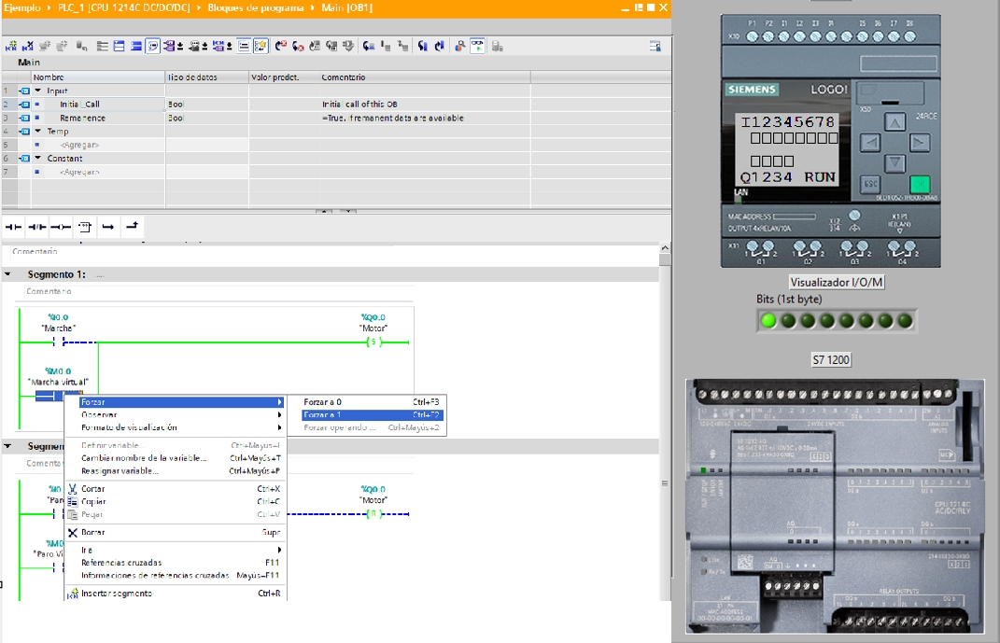
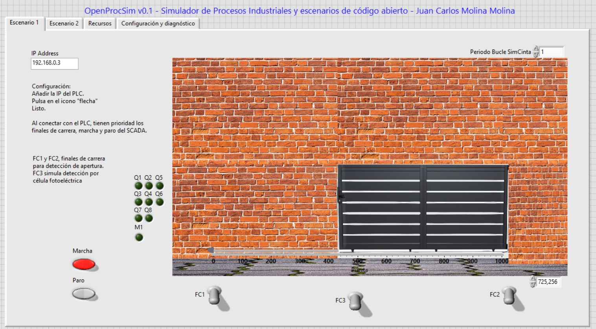
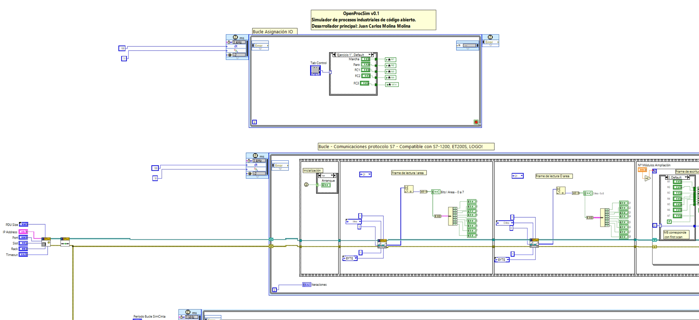
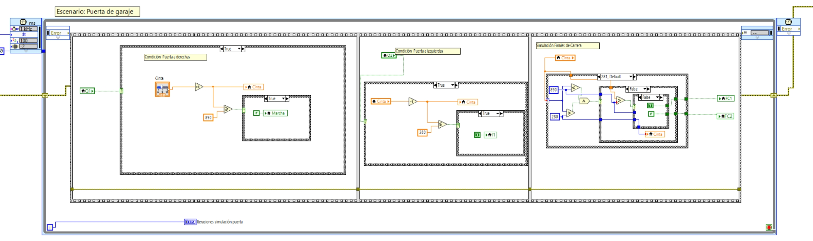

# OpenProcSim — Simulador Abierto de Procesos Industriales. 

**OpenProcSim** es una herramienta de simulación de procesos industriales, desarrollada en **LabVIEW** y orientada a la docencia en **Formación Profesional**. Su objetivo es ofrecer una alternativa **libre, gratuita y de código abierto** a los simuladores comerciales, especialmente adaptada a **equipos con recursos limitados** y a la realidad de los centros educativos.

Actualmente en **versión alfa**, OpenProcSim permite crear y ejecutar escenarios de automatización industrial compatibles con **S7-1200, Siemens LOGO! y ET200S**, facilitando prácticas realistas en entornos docentes sin necesidad de hardware físico.

## Características principales

- Desarrollado en LabVIEW  
- Libre, gratuito y de código abierto  
- Optimizado para ordenadores con recursos modestos  
- Diseñado para uso docente en ciclos de automatización  
- Funcional con controladores Siemens: LOGO! 8, S7-1200 y ET200S  
- Escenarios personalizables y ampliables  
- Comunidad educativa abierta en crecimiento  

## Cómo puedes participar

Este proyecto tiene vocación colaborativa. Se busca construir una comunidad docente activa en torno a OpenProcSim. Puedes contribuir de muchas formas:

- Proponiendo o diseñando nuevos escenarios de procesos industriales  
- Reportando errores o comportamientos inesperados  
- Probando nuevas versiones y compartiendo sugerencias  
- Ayudando en la depuración del código  
- Participando en el debate sobre funcionalidades futuras  

## Descarga y documentación

Incluye ejemplos básicos y documentación para la puesta en marcha.

## A quién va dirigido

- Profesorado de Formación Profesional en Automatización y Robótica Industrial  
- Centros que trabajan con LOGO!, S7-1200 o ET200S  
- Entornos educativos con infraestructura limitada  
- Personas interesadas en construir herramientas didácticas libres  

## Estado del proyecto

- Versión actual: Alfa (v0.1)  
- Última actualización: abril de 2025  
- En desarrollo continuo. Próximamente: más escenarios, compatibilidad ampliada, entorno gráfico mejorado y documentación extendida  

## Contacto

Para consultas, propuestas o colaboración con el proyecto, puedes escribir a:

**juancarlosmolina.docencia@gmail.com**
**juancarlos.molina2@murciaeduca.es**

Desarrollador principal: Juan Carlos Molina Molina. 

Profesor de Formación Profesional. Especialidad Instalaciones Electrotécnicas 

Investigador Universidad Politécnica de Cartagena. Departamento: Automática, Ingeniería Eléctrica y Tecnología Electrónica (2010-2022)

[https://portalinvestigacion.upct.es/investigadores/276036/detalle](https://portalinvestigacion.upct.es/investigadores/276036/detalle)

[www.linkedin.com/in/juan-carlos-molina-molina-234761348](www.linkedin.com/in/juan-carlos-molina-molina-234761348)

